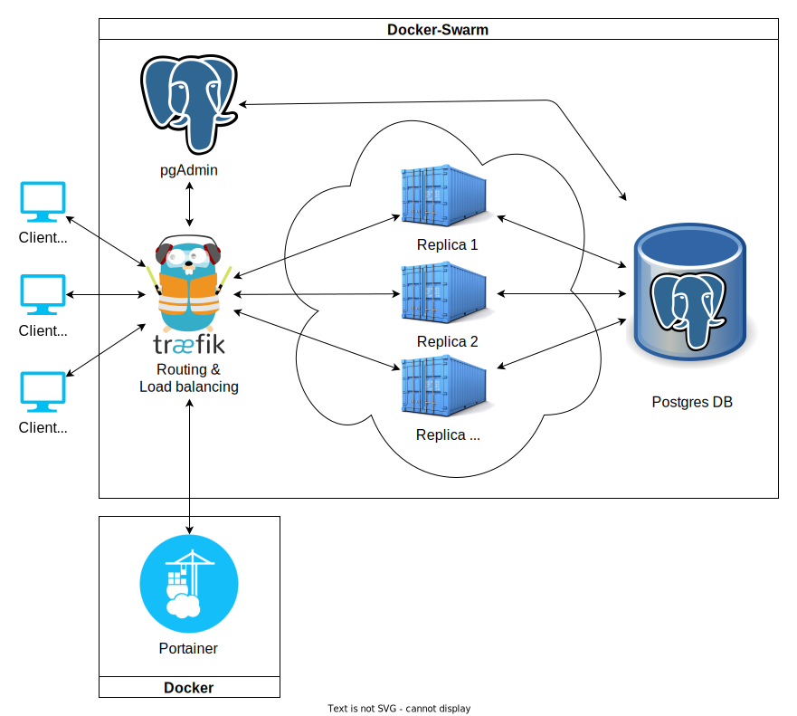

# Documentation
Project is live at [https://ostchat.site](https://ostchat.site)

## Index
- [Idea](#idea)
- [Architecture overview](#architecture)
- [Security](#security)
- [Note on statelessness of containers](#note-on-statelessness-of-containers)
- [Useful links](#useful-links)
- [Setup](#setup)

# Idea
Create a simple platform with a few pre-defined (but extensible) chat rooms, all of which are load-balanced and have built in redundancy.

# Architecture
The principle works as follows: Portainer is started in advance and deploys the rest of the stack, Traefik then routes all incoming traffic, including to Portainer itself. pgAdmin helps keep a better overview of the database contents.



All instances of the backend-swarm are identical and interchangeable.
Backends regularly poll the database through the pre-defined function `get_messages_after()`, which takes a message ID and returns all messages that are newer than it. This allows all backends to stay up to date with each-other without cross-replica-communication.
Sessions are done via arguments in the URL. We are aware that this is not very safe; however, we opted against sinking additional time into this aspect of the project, as explained in the [security](#security) chapter.

We had originally planned to create a "swarm of swarms" and have each `/chat/<n>/` be routed to the correct swarm (making each swarm responsible for a single chat), but we didn't get it to work right, so we simplified the architecture.

# Security
Security concerns (safe login, avoiding information disclosure through URL, etc.) have been disregarded for the sake of simplicity as the goal was to make a resilient system, not necessarily a secure one. Nevertheless, we took the time to set up HTTPS.


# Setup
Create a `.env` file on the server that contains the variables `MY_DOMAIN` set to the server's domain, in this case [ostchat.site](https://ostchat.site).
```bash
sudo docker network create -d bridge traefik_net
# Don't forget to replace ostchat.site with the proper domain
sudo docker run -d -p 8000:8000 -p 9000:9000 \
    --name=portainer \
    --restart=always \
    --env-file .env \
    -v /var/run/docker.sock:/var/run/docker.sock \
    -v /etc/localtime:/etc/localtime:ro \
    -v portainer_data:/data \
    --label "traefik.docker.network=traefik_net" \
    --label "traefik.http.services.portainer.loadbalancer.server.port=9000" \
    --label "traefik.http.routers.portainer.rule=Host(\`portainer.ostchat.site\`)" \
    --label "traefik.http.routers.portainer.entrypoints=websecure" \
    --label "traefik.http.routers.portainer.tls.certresolver=myresolver" \
    --label "traefik.enable=true" \
    --network=traefik_net \
    portainer/portainer-ce:latest
```
Then configure Portainer to build the stack directly from Gitlab.

# Useful links
- [Traefik TLS simple walkthrough](https://doc.traefik.io/traefik/user-guides/docker-compose/acme-tls/)
